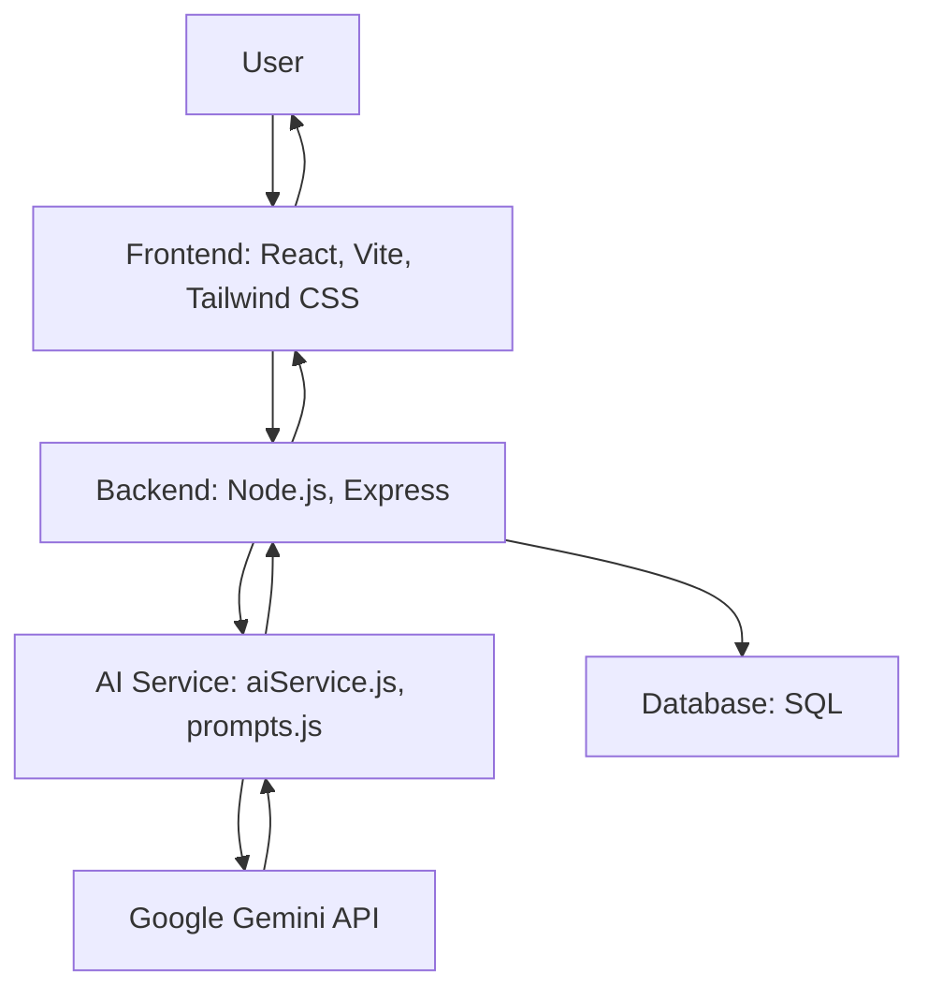

# Cognitive Performance System (CPS)


A next-generation productivity and cognitive enhancement platform powered by real-time AI (Google Gemini). CPS helps users achieve their goals by generating and adapting personalized work plans based on their input and psychological state.

---

## 🚀 What is CPS?
CPS is an AI-driven productivity system that:
- Collects your goals and current psychological state (energy, focus, stress, etc.)
- Uses Google Gemini AI to generate a structured, actionable work plan with recommended productivity layouts (Kanban, Pomodoro, Writer, etc.)
- Adapts your plan in real time as your state or context changes
- Tracks your sessions and progress for ongoing improvement

---

## ✨ Key Features
- **🤖 AI-Powered Planning:** Live integration with Google Gemini for dynamic, personalized session plans
- **⚡ Real-Time Adaptation:** Plans and layouts update instantly as your state or context changes
- **🗂️ Multiple Productivity Layouts:** Kanban, Pomodoro, Writer, Zen Focus, and more—AI recommends the best fit for your needs
- **🔒 Secure User Authentication:** All data is private and protected
- **📈 Session Tracking:** Review your progress and session history
- **💻 Modern, Responsive UI:** Built with React, Tailwind CSS, and Vite

---

## 🧠 How It Works


1. **Log in** to your dashboard
2. **Start a session** by entering your goal and psychological state
3. **AI generates a plan**: CPS sends your input to Gemini, which returns a JSON plan (tasks, layout, title)
4. **Work through your plan** in the recommended layout
5. **Update your state** at any time—CPS adapts your plan in real time
6. **Track your sessions** and review your progress

---

## 🛠️ Tech Stack
| Frontend         | Backend         | AI Integration         | Database   |
|------------------|----------------|-----------------------|------------|
| React, Vite      | Node.js, Express| Google Gemini API     | SQL (schema.sql) |
| Tailwind CSS     |                | @google/generative-ai |            |

---

## ⚡ Example Data Flow



---

## 🚀 Getting Started

1. **Clone the repo**
    ```sh
    git clone https://github.com/your-username/cognitive-performance-system.git
    ```
2. **Install dependencies** in both `frontend/` and `backend/`
    ```sh
    cd frontend && npm install
    cd ../backend && npm install
    ```
3. **Set up environment variables** (see `.env.example`)
4. **Run backend and frontend dev servers**
    ```sh
    # In one terminal
    cd backend && npm run dev
    # In another terminal
    cd frontend && npm run dev
    ```

---

## 📸 Screenshots & Demo


_Add your own screenshots or a demo GIF here to showcase the AI-driven planning and layout switching._

---

## 🗺️ Architecture & Data Flow

For a detailed overview, see the [architecture-and-dataflow.md](architecture-and-dataflow.md) file.

---

## 🛣️ Roadmap
- More productivity layouts
- Deeper analytics and insights
- Biometric device integration
- Team/collaborative features

---

## 📄 License
Distributed under the MIT License. See [LICENSE](LICENSE) for details.
