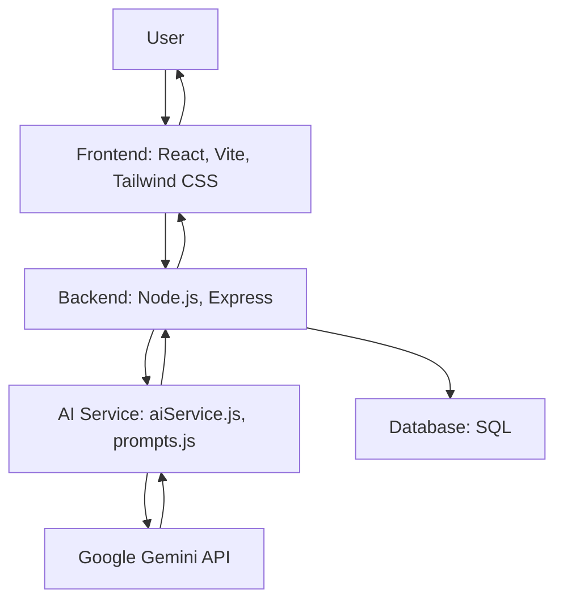
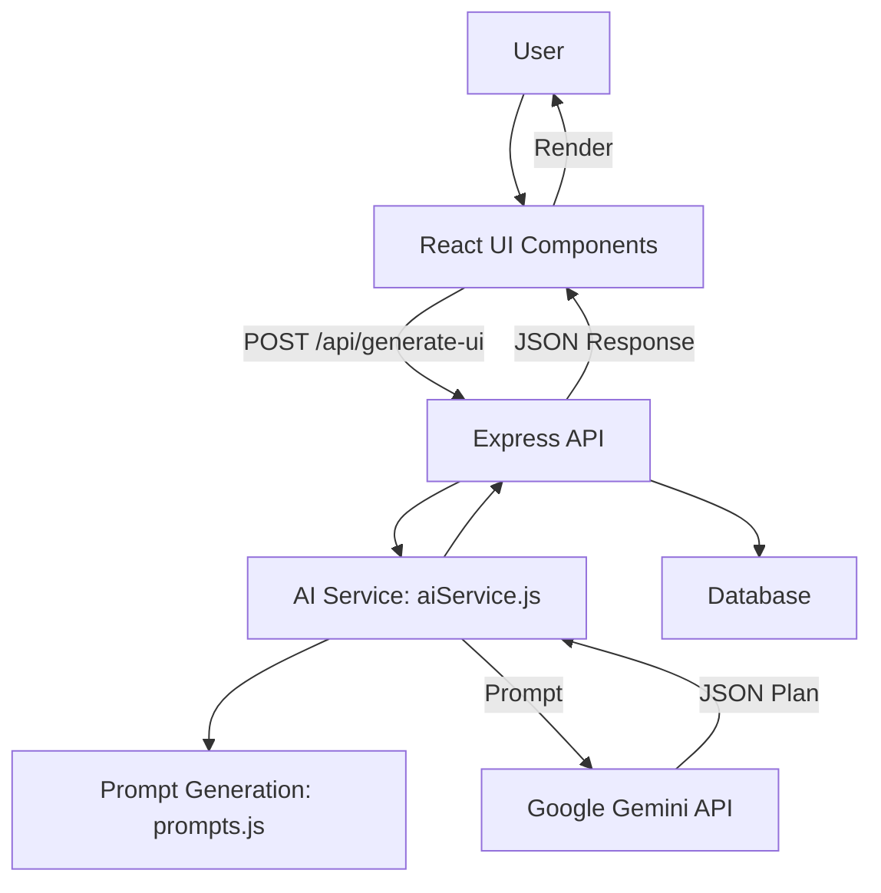

# Cognitive Performance System (CPS)

CPS is an AI-powered productivity and cognitive enhancement platform. It generates and adapts personalized work plans in real time, using Google Gemini AI, based on your goals and psychological state.

---

## Demo

[](https://youtu.be/P4fh43oas58)

---

## Layout Snapshots

See [`SNAPSHOTS.md`](SNAPSHOTS.md) for visual examples of all productivity layouts and the dashboard.

---

## Key Features

- **AI-Powered Planning:** Live integration with Google Gemini for dynamic, personalized session plans
- **Real-Time Adaptation:** Plans and layouts update instantly as your state or context changes
- **Multiple Productivity Layouts:** Kanban, Pomodoro, Writer, Zen Focus, and more—AI recommends the best fit for your needs
- **Secure User Authentication:** All data is private and protected
- **Session Tracking:** Review your progress and session history
- **Modern, Responsive UI:** Built with React, Tailwind CSS, and Vite

---

## How It Works

1. **Log in** to your dashboard
2. **Start a session** by entering your goal and psychological state
3. **AI generates a plan**: CPS sends your input to Gemini, which returns a JSON plan (tasks, layout, title)
4. **Work through your plan** in the recommended layout
5. **Update your state** at any time—CPS adapts your plan in real time
6. **Track your sessions** and review your progress

---

## Tech Stack

| Frontend         | Backend         | AI Integration         | Database   |
|------------------|----------------|-----------------------|------------|
| React, Vite      | Node.js, Express| Google Gemini API     | SQL (schema.sql) |
| Tailwind CSS     |                | @google/generative-ai |            |

---

## System Architecture



---

## Data Flow


---

> For a detailed architecture and data flow, see [`architecture-and-dataflow.md`](architecture-and-dataflow.md).

---

## Getting Started

1. **Clone the repo**
    ```sh
    git clone https://github.com/imsncht/cognitive-performance-system.git
    ```
2. **Install dependencies** in both `frontend/` and `backend/`
    ```sh
    cd cognitive-performance-system/frontend && npm install
    cd ../backend && npm install
    ```
3. **Set up environment variables** (see `.env.example`)
4. **Run backend and frontend dev servers**

---

## Roadmap

- More productivity layouts
- Deeper analytics and insights
- Biometric device integration
- Team/collaborative features

---

## Test Prompts for Layouts

See [`test-prompts.md`](test-prompts.md) for a collection of example user prompts you can use to trigger and test different productivity layouts in the system.

---

## License

Distributed under the MIT License. See [`LICENSE`](LICENSE) for details.