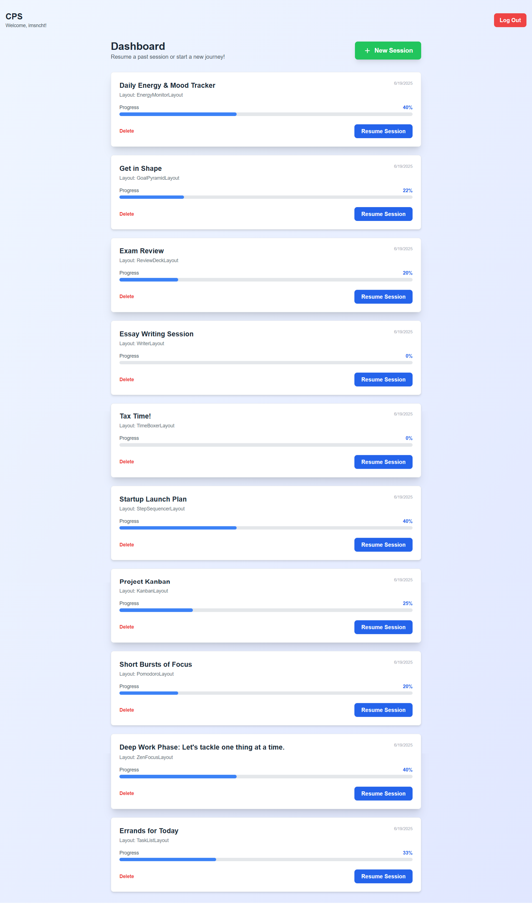
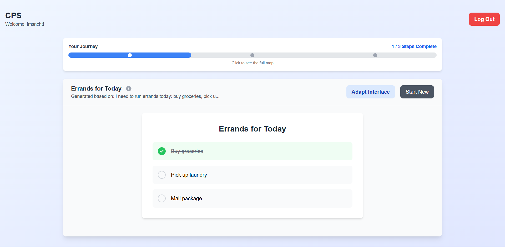
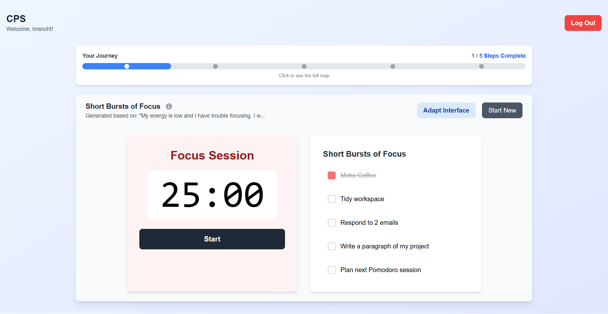
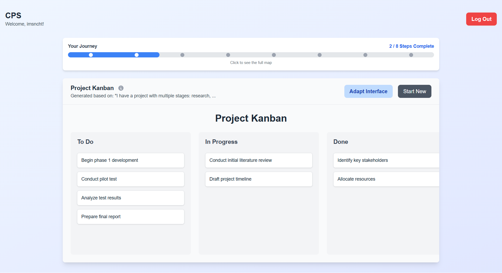
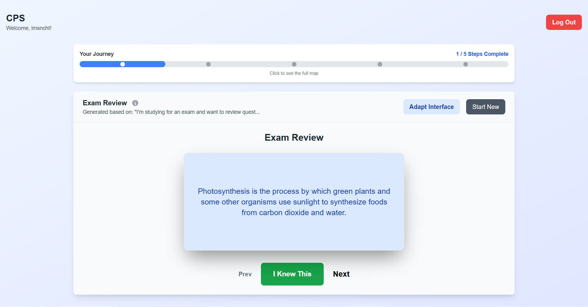
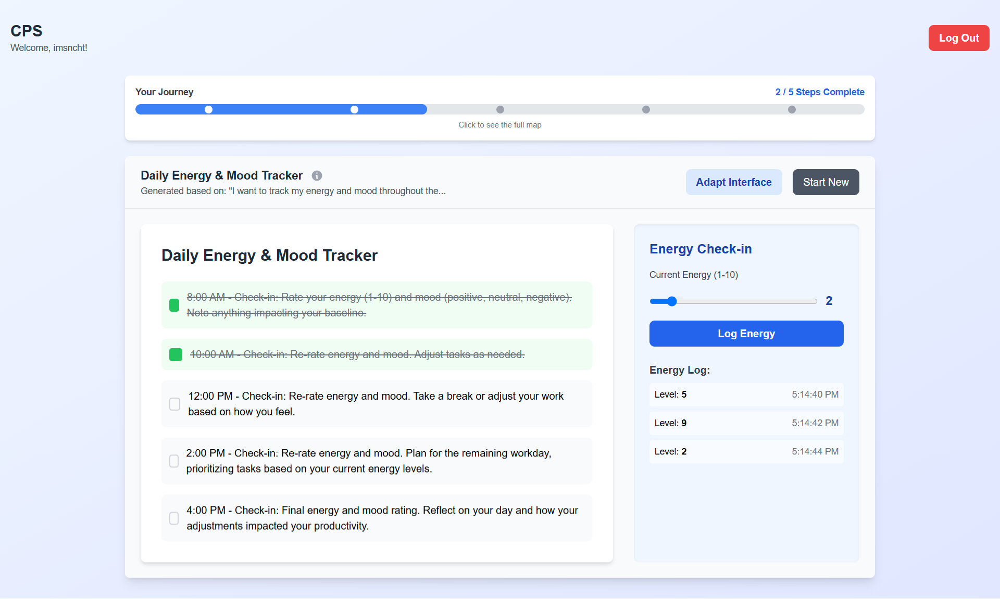

# CPS Layout Snapshots

This document showcases visual snapshots of all productivity layouts and the dashboard in the Cognitive Performance System. Use these images to quickly understand the look and feel of each layout.

---

## Dashboard

---

## Layouts

### 1. Task List Layout

### 2. Zen Focus Layout

### 3. Pomodoro Layout

### 4. Kanban Layout

### 5. Step Sequencer Layout

### 6. Time Boxer Layout

### 7. Writer Layout

### 8. Review Deck Layout

### 9. Goal Pyramid Layout

### 10. Energy Monitor Layout

---

> All images are located in `frontend/public/snapshots/`. If you add or update layouts, please update this file accordingly.
