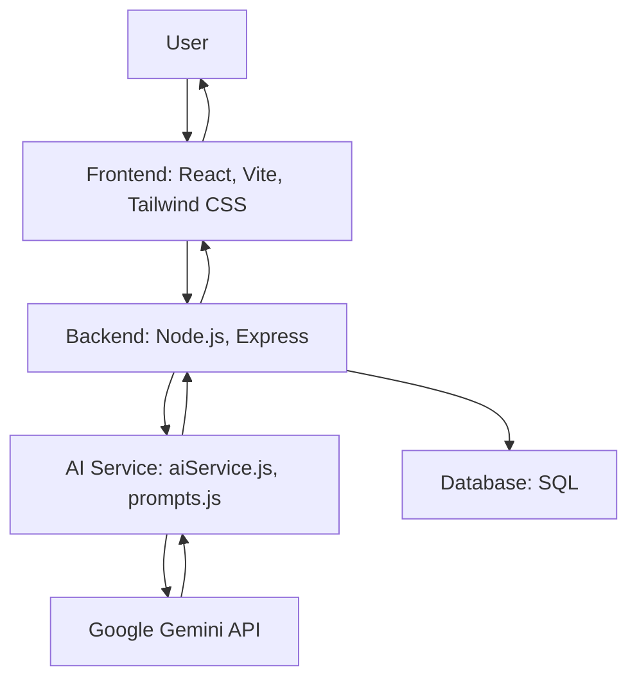
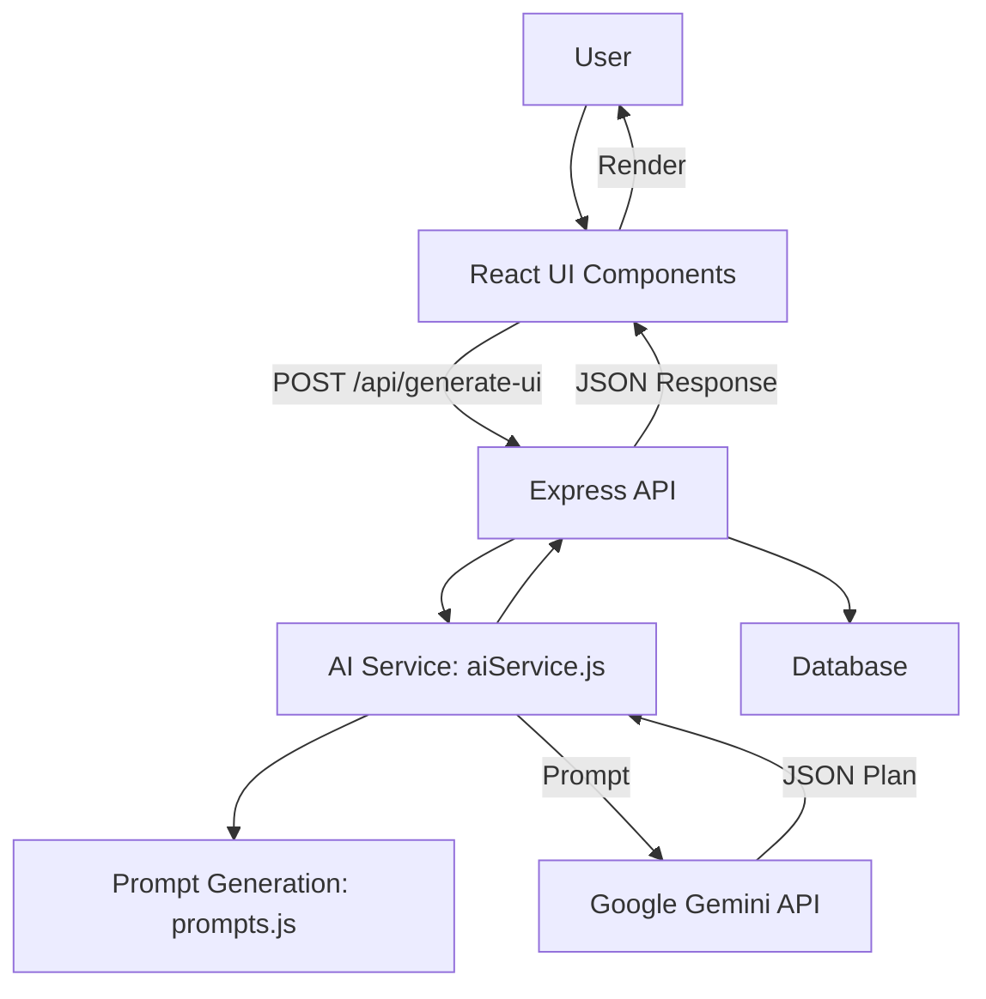

# Cognitive Performance System – Architecture & Data Flow

This document provides a comprehensive overview of the system architecture and data flow for the Cognitive Performance System, including both textual explanations and graphical (Mermaid) diagrams supported by GitHub markdown.

---

## 1. System Architecture (Textual)

### User Layer
```
[User]
  ↓
```

### Frontend (Client)
```
[React App (Vite, Tailwind CSS)]
   — Handles UI, user input, and displays AI-generated plans
   — Communicates with backend via REST API
   |
   ↓ 
```

### Backend (Server)
```
[Node.js + Express API]
   — Handles authentication, session management, and API endpoints
   — Integrates with AI Service and Database
   |
   |———→ [AI Service Layer]
   |         — aiService.js: Generates prompts, calls Gemini API, parses responses
   |         — prompts.js: Prompt templates for Gemini
   |
   |———→ [Database Layer]
   |          — Stores users, sessions, and interaction data (SQL)
   |
   ↓
```

### AI Integration
```
[Google Gemini API]
   — Receives prompts from backend
   — Returns structured JSON plans and recommendations
```
---

## 2. System Architecture (Graphical)



---

## 3. Data Flow (Textual)

### 1. User Interaction (Frontend)
```
[User]
   ↓
[React UI Components]
   ↓
```

### 2. API Request (Frontend to Backend)
```
[React UI] ——(POST /api/generate-ui or /api/update-ui)——→ [Express Backend]
   ↓
```

### 3. Backend Processing
```
[Express Route Handler]
   ↓
[AI Service (aiService.js)]
   ↓
[Prompt Generation (prompts.js)]
   ↓
```

### 4. AI Integration
```
[AI Service] ——→(Prompt)——→ [Google Gemini API]
   ↓
[Google Gemini API] ——(JSON Plan)——→ [AI Service]
   ↓
```

### 5. Backend Response
```
[AI Service] ——(Session Plan JSON)——→ [Express Route Handler]
   ↓
[Express Route Handler] ——(JSON Response)——→ [React UI]
   ↓
```

### 6. UI Update
```
[React UI] ——(Render Plan/Layout/Tasks)——→ [User]
```

### 7. (Optional) Data Persistence
```
[Express Backend] ——(Session Data)——→ [Database]
```

---

## 4. Data Flow (Graphical)



---

## Legend
- [Brackets]: System/component/module
- Arrows (→): Direction of data flow
- (Parentheses): Type of data/request

---

This document gives you both a high-level and detailed view of how the Cognitive Performance System works, with both textual and visual (Mermaid) diagrams for clarity.
